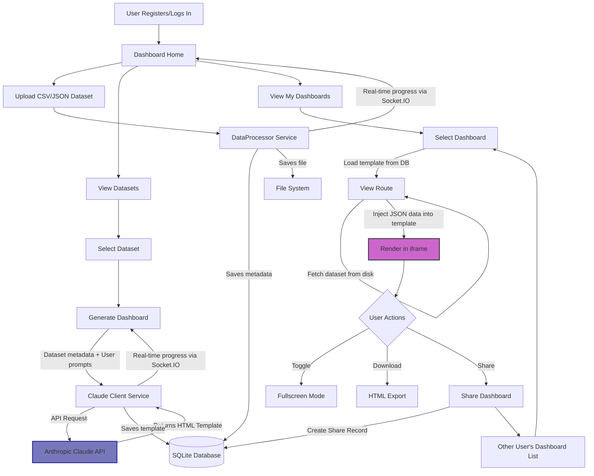
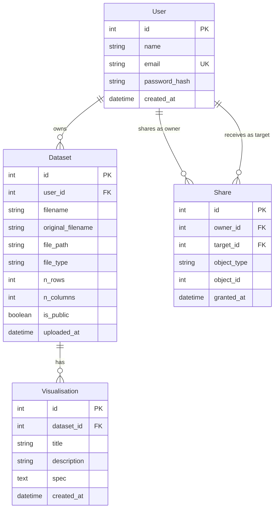

# 🚀 DynaDash

<p align="center">
  
  
  
  
  
</p>

<p align="center">
  <b>A web-based data-analytics platform powered by Claude AI</b>
</p>

<p align="center">
  <i>Upload private datasets • Generate AI-powered visualizations • Share insights • Analyze data with ease</i>
</p>

## ⚡ Quick Start

### Prerequisites

- Python 3.8+
- pip
- Git
- Anthropic API key (for Claude)

### Setup & Installation

1. **Clone the repository**

```bash
git clone https://github.com/MaLoskins/DynaDash.git
cd DynaDash
```

2. **Create and activate a virtual environment**

```bash
# For Windows
python -m venv venv
venv\Scripts\activate

# For macOS/Linux
python -m venv venv
source venv/bin/activate
```

3. **Install dependencies**

```bash
pip install -r requirements.txt
```

4. **Configure environment variables**

Create a `.env` file based on the provided `.env.example`:

```bash
cp .env.example .env
```

Edit the `.env` file with your settings, especially your Anthropic API key (For the purposes of submission a preloaded key is provided in the submitted `.env` and `.env.example`):

```ini
# Flask settings
FLASK_APP=run.py
FLASK_ENV=development
SECRET_KEY=your_secret_key_here_change_in_production

# Database settings
DYNA_SQLITE_PATH=sqlite:///dynadash.db

# Server settings
HOST=127.0.0.1
PORT=5000

# Anthropic Claude API settings
ANTHROPIC_API_KEY=your_anthropic_api_key_here
```

5. **Initialize the database**

```bash
flask db init
flask db migrate -m "Initial migration"
flask db upgrade
```

6. **Run the application**

```bash
# Option 1
flask run

# Option 2
python run.py
```

7. **Access the application**

Open your browser and navigate to http://127.0.0.1:5000

## 📋 Table of Contents

- [Overview](#-overview)
- [Key Features](#-key-features)
- [Architecture](#-architecture)
- [Database Schema](#-database-schema)
- [Screenshots](#-screenshots)
- [Usage Guide](#-usage-guide)
- [API Documentation](#-api-documentation)
- [Technology Stack](#-technology-stack)
- [Project Structure](#-project-structure)
- [Troubleshooting](#-troubleshooting)
- [License](#-license)
- [Team](#-team)

## 🔍 Overview

DynaDash ("Dynamic Dashboard") is an intelligent data visualization platform that combines the power of Claude AI with intuitive web interfaces. It allows users to upload datasets, automatically generate insightful visualizations, organize them in a personal gallery, and selectively share with collaborators.

<p align="center">
  
</p>

## ✨ Key Features

<table>
  <tr>
    <td width="33%">
      <h3 align="center">🔐 User Authentication</h3>
      <ul>
        <li>Secure registration and login</li>
        <li>Password management</li>
        <li>Session management</li>
      </ul>
    </td>
    <td width="33%">
      <h3 align="center">📊 Dataset Management</h3>
      <ul>
        <li>Upload CSV and JSON files</li>
        <li>Preview data content</li>
        <li>Manage private datasets</li>
      </ul>
    </td>
    <td width="33%">
      <h3 align="center">🤖 AI-Powered Visualization</h3>
      <ul>
        <li>Claude API integration</li>
        <li>Smart chart selection</li>
        <li>Automated insights detection</li>
      </ul>
    </td>
  </tr>
  <tr>
    <td width="33%">
      <h3 align="center">⚡ Real-time Updates</h3>
      <ul>
        <li>Processing status tracking</li>
        <li>WebSockets (Socket.IO)</li>
        <li>Live dashboard updates</li>
      </ul>
    </td>
    <td width="33%">
      <h3 align="center">🔄 Gallery & Sharing</h3>
      <ul>
        <li>Personal visualization gallery</li>
        <li>Selective sharing with users</li>
        <li>Permission management</li>
      </ul>
    </td>
    <td width="33%">
      <h3 align="center">📱 Responsive Design</h3>
      <ul>
        <li>Mobile-friendly interface</li>
        <li>Interactive dashboards</li>
        <li>Fullscreen visualization mode</li>
      </ul>
    </td>
  </tr>
</table>

## 🏗 Architecture

DynaDash follows a modern web application architecture with a Python Flask backend, SQLite database, and browser-based frontend using Tailwind CSS and JavaScript.

<p align="center">
  
</p>

### Workflow

1. **Data Upload**: Users upload CSV or JSON data files through the web interface
2. **Processing**: The backend validates and processes the data
3. **Claude AI Analysis**: The Anthropic Claude API analyzes the data and generates visualizations
4. **Dashboard Creation**: Interactive HTML/JS dashboards are created and stored
5. **Gallery Management**: Users can view, organize, and share their visualizations
6. **Collaboration**: Selected visualizations can be shared with other platform users



## 📊 Database Schema

The database schema below illustrates how the data is organized and related within the DynaDash application:



This diagram shows the four main entities in the system and their relationships:

- **User**: Represents application users with authentication details
- **Dataset**: Contains uploaded data files and their metadata
- **Visualisation**: Stores AI-generated visualizations created from datasets
- **Share**: Manages access permissions between users for datasets and visualizations

The relationships include:
- One user can own many datasets (one-to-many)
- One dataset can have many visualizations (one-to-many)
- Users can share objects with other users through the Share entity
- The Share table tracks both the owner and the target user of each sharing action

## 📸 Screenshots

<details>
<summary>Click to view application screenshots</summary>

### Welcome Page
<p align="center">
  
</p>

### User Dashboard
<p align="center">
  
</p>

### Upload Interface
<p align="center">
  
</p>

### Visualization Gallery
<p align="center">
  
</p>

### Generated Dashboard Example
<p align="center">
  
</p>

</details>

## 📚 Usage Guide

### Creating an Account

1. Visit the homepage and click "Register"
2. Fill in your name, email, and password
3. Submit the form to create your account
4. Log in with your new credentials

### Uploading a Dataset

1. Navigate to the "Upload" page from the main menu
2. Drag and drop a CSV or JSON file, or click to select a file
3. Preview the data and click "Upload"
4. Wait for the processing to complete

### Generating Visualizations

1. Go to "My Datasets" and select the dataset you want to visualize
2. Click "Generate Visualization"
3. Provide a title and description for your dashboard
4. Click "Generate" and wait for Claude AI to create your dashboard
5. Once complete, you'll be redirected to view your new dashboard

### Managing and Sharing Visualizations

1. Browse your visualizations in the "My Dashboards" page
2. Click on any visualization to view it
3. Use the "Share" button to grant access to other users
4. Select users to share with and confirm
5. Shared users will see your visualizations in their "Shared With Me" section

### Viewing and Interacting with Dashboards

1. Click on any dashboard to view it in full detail
2. Use interactive controls to filter and explore the data
3. Switch to fullscreen mode for presentations
4. Download the HTML dashboard for offline viewing or sharing

## 🔌 API Documentation

DynaDash provides a RESTful API for programmatic access to your data and visualizations.

<details>
<summary>Click to view API endpoints</summary>

### Authentication

```
POST /api/v1/login
POST /api/v1/logout
POST /api/v1/register
GET  /api/v1/user
GET  /api/v1/users
```

### Visualizations

```
GET  /api/v1/visualisations
GET  /api/v1/shared-visualisations
GET  /api/v1/visualisations/<id>
```

</details>

## 🔧 Technology Stack

### Backend
- **Flask**: Web framework
- **SQLAlchemy**: ORM for database operations
- **Flask-SocketIO**: Real-time communication
- **Flask-Login**: User authentication
- **Flask-Migrate**: Database migrations
- **Flask-WTF**: Form handling and validation

### Frontend
- **HTML/CSS/JavaScript**: Base web technologies
- **Tailwind CSS**: Styling and UI components
- **jQuery**: DOM manipulation and AJAX
- **Socket.IO**: Client-side WebSocket communication
- **Chart.js/D3.js**: Visualization libraries

### Database
- **SQLite**: Lightweight SQL database
- **Alembic**: Database migration engine

### External Services
- **Anthropic Claude API**: AI model for data analysis and visualization generation

## 📂 Project Structure

```
DynaDash/
├── app/                    # Application package
│   ├── blueprints/         # Flask blueprints
│   │   ├── auth/           # Authentication routes
│   │   ├── data/           # Dataset management routes
│   │   └── visual/         # Visualization routes
│   ├── models.py           # Database models
│   ├── services/           # Service classes
│   │   ├── claude_client.py # Anthropic Claude API client
│   │   └── data_processor.py # Dataset processing service
│   ├── static/             # Static files (CSS, JS, images)
│   ├── templates/          # Jinja2 templates
│   ├── __init__.py         # Application factory
│   ├── cli.py              # CLI commands
│   └── errors.py           # Error handlers
├── migrations/             # Database migrations
├── tests/                  # Test suite
│   ├── unit/               # Unit tests
│   └── integration/        # Integration tests
├── uploads/                # Uploaded datasets
├── .env.example            # Example environment variables
├── .gitignore              # Git ignore file
├── config.py               # Application configuration
├── requirements.txt        # Python dependencies
├── run.py                  # Application entry point
└── README.md               # Project documentation
```

## ❓ Troubleshooting

<details>
<summary>Common Issues and Solutions</summary>

### Installation Problems

**Issue**: `ModuleNotFoundError: No module named 'flask'`  
**Solution**: Ensure you've activated your virtual environment and installed requirements:
```bash
source venv/bin/activate  # or venv\Scripts\activate on Windows
pip install -r requirements.txt
```

**Issue**: Database migration errors  
**Solution**: Reset migrations and initialize again:
```bash
rm -rf migrations
flask db init
flask db migrate -m "Initial migration"
flask db upgrade
```

### Runtime Errors

**Issue**: Claude API errors  
**Solution**: Verify your API key in the `.env` file and check your API usage limits.

**Issue**: File upload errors  
**Solution**: Check that the `uploads` directory exists and has proper write permissions.

**Issue**: Socket.IO connection issues  
**Solution**: Ensure you're not using an ad-blocker that might be blocking WebSocket connections.

</details>

## 📄 License

This project is licensed under the MIT License - see the [LICENSE](LICENSE) file for details.

## 👥 Team

DynaDash was created by:

- **Matthew Haskins** - Claude integration & chart renderer
- **Leo Chen** - DB model & SQLite ops
- **Jonas Liu** - REST API & develop endpoints
- **Ziyue Xu** - Security & API gateway

<p align="center">
  
</p>
